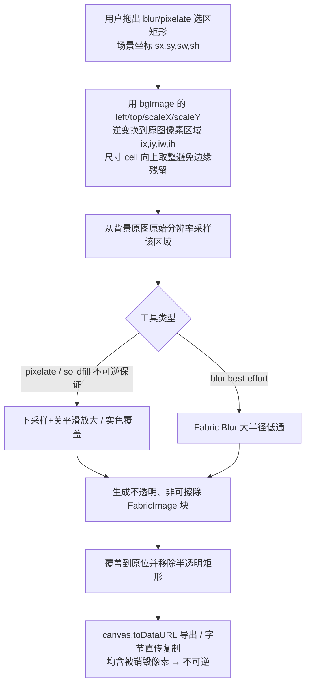

# feat: Harden DDU macOS to daily-reliable

## Summary

一次聚焦的 macOS 质量加固:把真实不可逆打码、路径穿越漏洞、关键路径 panic、保存路径被启动覆盖、快捷键改了不生效、复制无反馈、预览浮窗行为修扎实,并新增一个复用现有编辑器的「多张截图拼成一张」功能。门槛是「自用 / 日常可靠」——不含公证打包、i18n、自动更新、跨平台。

---

## Problem Frame

当前 macOS 版「看着全、用着虚」:打码是半透明灰框(原内容渗出、可还原)、删除/导出/读图命令对任意路径无校验、关键路径上约 40 处 `unwrap()` 会在磁盘满/无权限时 panic、用户设的保存路径每次启动被覆盖、设置里改的快捷键根本没被读、复制后没有任何反馈。这些缺口直接踩中「日常可靠」门槛。本轮只把已承诺、每天会碰到的东西做真、做对、做稳,并补上一个高频的拼图需求。完整动机见 origin: `docs/brainstorms/2026-06-29-harden-macos-daily-reliable-requirements.md`。

---

## Requirements

**安全与信任**

- R1. 模糊/像素化必须对底层图像区域做不可逆的真实像素处理,导出图中该区域无法恢复原内容。（origin R1）
- R2. 所有接受前端路径的命令(删除历史、导出、读详情、读 base64、复制)把目标限制在受控截图目录内,拒绝越界/穿越路径;导出目标改为后端解析;收紧 fs capability 作用域。（origin R2）

**健壮性(不崩溃 / 不丢数据)**

- R3. 用户可达热路径(截图→保存→预览→复制→历史→OCR)上的 `unwrap()`/`expect()` 替换为错误传播,失败时给可见提示而非崩溃。（origin R3）
- R4. 带标注「复制」不再遗留临时文件。（origin R4）
- R5. 设置界面每一项真实持久化并跨重启生效;「历史保留期」成为可执行且安全的行为;无法本轮接通的控件(如按容量裁剪)从 UI 移除。（origin R5）

**日常工作流**

- R6. 启动不再无条件覆盖 `screenshot_path`;用户配置的保存路径跨重启保留且前端可读/列/删/显示。（origin R6）
- R7. 在设置里修改快捷键后,全局快捷键即时按新值重新注册并生效;失败时不留「零快捷键」状态。（origin R7）
- R8. 复制到剪贴板成功/失败都给出即时可见反馈。（origin R8）
- R9. 预览浮窗的显示/隐藏行为符合直觉,消除 minimize/unminimize 带来的副作用。（origin R9）
- R10. 捕获真正按用户存储的设置(延时 / 含光标 / 窗口阴影)执行;原生选区框及不可用的标志(交互模式下的光标)记录为已知限制。（origin R10）

**拼图(多张合成)**

- R11. 用户可从主窗口历史列表多选若干截图,合并为一张图。（origin R11）
- R12. MVP 支持横排与竖排两种布局。（origin R12）
- R13. 合成结果进入现有编辑器,可继续标注并通过现有导出/复制路径输出。（origin R13）

---

## Key Technical Decisions

- KTD1. **真实打码走画布侧、不透明替换;不可逆性由像素化/实色覆盖保证。** 在 `applyPrivacyEffect` 里:按选区矩形反算到背景原图像素区域(`bgImage` 的 left/top/scaleX/scaleY 逆变换,采样原始分辨率),对该区域做像素化(下采样→关闭平滑放大)或实色覆盖,生成**不透明、非可擦除**的图像块覆盖原位并移除半透明矩形。**像素化/实色是不可逆保证;高斯模糊是 best-effort**(低通滤波,高信噪比文字可被反卷积部分还原),UI/文档应标注「模糊不作为强隐私手段,敏感信息用像素化/实色」。补丁区域尺寸向上取整(ceil)以避免 1px 边缘残留。导出(`toDataURL`)与复制因此继承不可逆性。备选:导出时把区域几何传给 Rust 用 `image` crate 处理原图——本轮不选(两条输出路径各传几何、预览与输出分别渲染,复杂度更高)。
- KTD2. **路径守卫覆盖所有取路径的命令 + 导出目标后端解析 + capability 清理。** 新增 `ensure_within_images_dir(path)`:对 canonicalize 后的路径用**组件级 `Path::starts_with`**(非字符串前缀,避免 `…/DDU` 命中 `…/DDU-evil`)校验受控图片目录;canonicalize 失败即 **fail-closed**(对已不存在的删除目标,改为校验其父目录)。守卫覆盖 `delete_history_items`、`get_history_item_detail`、`export_image` 的 source、**`get_image_base64`**、以及旧的 **`copy_image_to_clipboard`**。`export_image` 的**目标路径不再信任前端传入**——把原生保存对话框移到 Rust 端,解析后的路径不经渲染进程(消除任意图片写原语)。`filesystem.json` 清理:删重复键、`$HOME/test.txt` 残留、收紧 `$HOME/*`,**并删除裸 `fs:allow-read`/`fs:allow-write`(无作用域=默认不受限)**。
- KTD3. **快捷键运行时热重载 + 动态映射 + 失败回滚。** 启动时从 store 读 `hotkey_fullscreen`/`hotkey_region`/`hotkey_window`(缺省回退默认);用注册为 **managed state** 的 `Mutex<HashMap<ShortcutId, CaptureAction>>` 把动态快捷键映射到动作(fullscreen→`capture_screen`、region→`capture_select`、window→`capture_window`),plugin handler 闭包运行时读取该 state(插件在 setup 前构建,故必须走 managed state 而非编译期常量)。新增命令 `apply_shortcuts`:**先快照当前可用注册集**→ `unregister_all` → 逐键注册;任一键失败则**回滚到快照**并返回失败的组合,绝不留「零快捷键」状态。`ShortcutSettings.vue` 保存后调用,内联错误并保留用户输入值。
- KTD4. **复制走字节直传、消灭临时文件、退役旧命令。** 新增剪贴板命令接收 base64/字节直接写剪贴板(复用 `copy_picture_to_clipboard` 的 RGBA 转换但不落盘);`handleCopy` 改为直传字节,删除临时文件写入。U5 同时**从 `invoke_handler` 退役旧的 `copy_image_to_clipboard`**(或加 U2 守卫),避免任意路径→剪贴板的读回外泄链。
- KTD5. **历史保留 = 按龄自动清理,带安全默认(已与用户确认为真删)。** 启动时(及捕获后)按 `history_retention_days` 删除超期截图。**安全默认:键缺失 / 0 / 负值(除 -1)= 不删;下限为 1;`-1`=永久保留;首次启用按龄清理前需用户一次性显式 opt-in。** 清理范围**仅匹配 app 生成的文件名**(`screenshot_*` / `*_annotated.*`)**并叠加 U2 受控目录守卫**——防止用户把保存路径指向已有图片目录时误删其个人文件。max-size 按容量裁剪不接通,本轮**从 UI 移除该控件**(origin R5:接不上的从 UI 移除),列入 Deferred。
- KTD6. **「选区体验」落地为让捕获按设置执行(含 macOS 限制)。** 把已存储但未使用的捕获设置接进 `screencapture` 参数:延时 `-T`、窗口模式 `-o`(无阴影)对所有相关命令通用;**`include_cursor`(`-C`)仅对非交互全屏捕获生效**(`screencapture` 文档:`-C` 仅非交互模式),区域(`-i`)/窗口(`-iw`)交互捕获下记录为已知限制,不接无效标志。原生选区 overlay 的放大镜/键盘微调等不在本轮。
- KTD7. **测试策略务实。** Rust 侧把可测纯逻辑(路径守卫、保留期筛选、打码坐标映射、screencapture 参数装配)提取为纯函数并 `#[cfg(test)]` 单测;前端无测试运行器,打码不可逆等关键行为以脚本/手动验证为主,本轮不强制引入整套前端测试基建。
- KTD8. **拼图复用编辑器 + 落盘传输。** 历史多选 → 把所选图按横/竖布局合成为一张背景位图 → **写入受控图片目录(复用保存流程)** → 经现有 `image-prepared` 事件打开预览窗 `ImageEditor`(编辑器在独立预览窗,只接收文件路径,无内存跨窗通道) → 走现有 Save As / Copy。不新建独立拼图器。
- KTD9. **自定义保存路径的前端可读性 = 读写统一走后端命令。** R6 允许保存路径落在 `$APPDATA` 之外,但前端的读/列/删/显示当前走 plugin-fs(`readDir`/`readFile`/`remove`)与 `assetProtocol`(`convertFileSrc`),二者作用域都钉死 `$APPDATA`,且 U2 还要收紧——自定义路径会列不出、显示不出、删不掉。**决策:前端所有图片读取/列举/删除/显示统一改走 Rust 命令**(`list_history_items`/`get_image_base64`/`delete_history_items` 已是后端;`PictureReview` 的显示从 `convertFileSrc` 改为后端 base64;`SnapVault` 的 `readDir`/`remove` 改为后端命令),从而绕过 assetProtocol/fs 作用域、允许 capability 保持收紧。备选(更脆):启动时把用户路径动态注入两处作用域。**必须在 U2 收紧作用域前落定**(见 Open Questions)。

---

## High-Level Technical Design

打码是本轮风险最高、最不直观的单元——核心在于「画布选区坐标」与「背景原图像素」之间的映射,以及让导出/复制都吃到被销毁的像素。数据流:

关键不变量:补丁采样**原图分辨率**且尺寸 ceil;像素化/实色是不可逆保证(blur 不是)。补丁加入后参与 `toJSON` 历史序列化,撤销/重做在编辑器内可还原原图,但**导出文件不可逆**(满足 AE1)。⚠️ 因此**严禁把 `canvas.toJSON()` / undo 栈持久化到磁盘**(会把全分辨率原图嵌进 JSON);本轮无此持久化,需在实现时确认不引入。注意导出 `toDataURL({multiplier:1})` 是在已缩放的画布上取图——见 Risks 中导出分辨率一项。

---

## Implementation Units

### Phase 1 — 安全与信任(P0)

### U1. 修保存路径覆盖 + get_images_dir 去 panic
- **Goal:** 用户配置的保存路径跨重启保留;构造图片目录的路径不再 panic。
- **Requirements:** R6, R3
- **Dependencies:** 无(基础单元;U2/U6/U7 依赖正确的图片目录;自定义路径的前端可读性见 KTD9/U2)
- **Files:** `src-tauri/src/lib.rs`, `src-tauri/src/common.rs`
- **Approach:** `lib.rs` setup 改为**仅当** `screenshot_path` 缺失或为空时才写默认 app_local_data,不再每次启动无条件覆盖。`common.rs:get_images_dir` 的 value 提取(`:24` `.unwrap()`)与 `app_local_data_dir()`(`:29` `.unwrap()`)改为 `Result`/带回退。
- **Patterns to follow:** 现有 `Result<_, String>` + `map_err(|e| e.to_string())`(`common.rs:44`)。
- **Test scenarios:**
  - `get_images_dir`:store 中 value 为空 → 回退 app_local_data;非空 → 使用该路径并 join `path`。
  - store 缺 `screenshot_path` 键 → 返回 Err 而非 panic。
  - Covers AE3.(重启保留属端到端/手动验证)
- **Verification:** 设自定义保存路径 → 重启 → 路径仍为自定义值,新截图落在该处。

### U2. 路径守卫(全命令)+ 导出后端解析 + 前端读写改后端 + capability 清理
- **Goal:** 所有取路径命令拒绝受控目录外路径;导出目标不经渲染进程;自定义路径前端可读;fs 作用域收紧。
- **Requirements:** R2, R6(配合 KTD9)
- **Dependencies:** U1
- **Files:** `src-tauri/src/common.rs`(新增 `ensure_within_images_dir`), `src-tauri/src/cmd/history.rs`, `src-tauri/src/cmd/export.rs`, `src-tauri/src/cmd/common.rs`, `src-tauri/src/lib.rs`, `src-tauri/capabilities/filesystem.json`, `src-tauri/tauri.conf.json`(assetProtocol scope), `src/pages/preview/PictureReview.vue`, `src/pages/main/components/SnapVault.vue`
- **Approach:** 见 KTD2 与 KTD9。守卫用组件级 `Path::starts_with` + canonicalize-fail-closed(删除目标不存在时校验父目录);覆盖 `delete_history_items` / `get_history_item_detail` / `export_image` source / `get_image_base64` / `copy_image_to_clipboard`。`export_image` 把原生保存对话框移到 Rust 端,目标路径后端解析。前端读/列/删/显示统一改走后端命令(`PictureReview` 显示改后端 base64;`SnapVault` 的 `readDir`/`remove` 改后端),使自定义路径可用且作用域可收紧。`filesystem.json` 删重复键、`$HOME/test.txt`、裸 `fs:allow-read`/`fs:allow-write`,收紧 `$HOME/*`。
- **Patterns to follow:** `common.rs` 的 `Result` 风格;`std::fs::canonicalize`;`std::path::Path::starts_with`。
- **Test scenarios:**
  - 守卫:受控目录内合法路径 → Ok;`../../<外部文件>`、绝对越界、兄弟目录 `…-evil` → Err(组件级,非字符串前缀)。
  - `delete_history_items` / `get_image_base64` 传越界路径 → 拒绝,外部文件不被读/删。
  - `export_image` 目标在受控目录外(经后端对话框以外的直接 invoke)→ 拒绝。
  - `filesystem.json` 不再含裸 `fs:allow-*` 与 `$HOME/test.txt`。
  - Covers AE2.
- **Verification:** 构造越界/兄弟目录路径调用各命令 → 外部文件不受影响;自定义保存路径下历史列表/缩略图/删除均正常;Save As 到桌面成功(经后端)。

### U3. 真实不可逆打码
- **Goal:** 像素化/实色覆盖真实销毁底层像素,导出/复制不可恢复;blur 标注为 best-effort。
- **Requirements:** R1
- **Dependencies:** 无(前端独立)
- **Files:** `src/pages/preview/editor/useEditor.ts`, `src/pages/preview/editor/EditorToolbar.vue`(blur 提示文案)
- **Approach:** 见 KTD1 与 HTD。重写 `applyPrivacyEffect`:选区矩形→背景原图像素区域(ceil 向上取整)→ 原分辨率采样 → 像素化(下采样+关平滑放大)或实色覆盖(不可逆保证),blur 走大半径 Fabric `Blur`(best-effort,文案标注非强隐私)→ 生成不透明、非可擦除 `FabricImage` 块覆盖原位 → 移除半透明矩形 → `saveState()`。
- **Technical design (directional):** 补丁取自 `bgImage` 原始 element 而非画布像素;坐标映射提取为可单测纯函数。
- **Test scenarios:**
  - Covers AE1. 像素化覆盖文字 → 导出 PNG → 该区域像素无法对应原文(脚本比对:无高频文本结构)。
  - 背景图被缩放时打码块准确落在所选区域、边缘无 1px 残留(ceil)。
  - pixelate/solidfill 输出完全不透明(无 alpha 渗出);blur 仅作 best-effort。
  - 导出与复制输出一致不可逆。
- **Execution note:** 先写「导出后不可逆」验证脚本/断言,再实现,锁住不变量。
- **Verification:** 导出与复制的图中像素化区域不可还原;编辑器内撤销仍可移除打码块;确认无任何路径把 undo 栈/canvas JSON 写盘。

### Phase 2 — 日常工作流正确性

### U4. 快捷键运行时热重载(含失败回滚)
- **Goal:** 设置里改快捷键后即时生效;失败不留零快捷键状态。
- **Requirements:** R7
- **Dependencies:** U1
- **Files:** `src-tauri/src/global_shortcut.rs`, `src-tauri/src/lib.rs`(注册命令 + managed state), `src/pages/setting/componnets/ShortcutSettings.vue`
- **Approach:** 见 KTD3。启动读 store 三键(`hotkey_fullscreen`/`hotkey_region`/`hotkey_window`,回退默认);`Mutex<HashMap<ShortcutId, CaptureAction>>` 注册为 managed state 供 handler 闭包运行时读取;handler 按映射分发(替换 `:62/:68/:74` 硬编码常量比对)。`apply_shortcuts`:快照→`unregister_all`→逐键注册→任一失败回滚快照并返回失败组合;`ShortcutSettings.vue` 保存后调用,内联错误、保留输入值。
- **Patterns to follow:** `register_global_shortcut` 与插件 builder(`global_shortcut.rs:37,55`);store 读取 `common.rs:get_store`;Tauri managed state。
- **Test scenarios:**
  - Covers AE4. 改区域键并 apply → 新组合触发区域截图,旧组合不再触发。
  - store 无自定义值 → 回退默认三键且可触发。
  - 第二/三键注册失败(模拟占用)→ 回滚到上次可用集合,返回失败组合,不出现零快捷键。
- **Verification:** 不重启改键即用;冲突给出内联可见提示且原快捷键仍可用。

### U5. 复制:去临时文件 + 反馈 + 退役旧命令
- **Goal:** 复制不遗留临时文件;成功/失败都有可见反馈;旧任意路径复制命令退役。
- **Requirements:** R4, R8
- **Dependencies:** 无
- **Files:** `src-tauri/src/cmd/common.rs`(字节直传命令 + 退役/守卫旧命令), `src-tauri/src/lib.rs`, `src/pages/preview/editor/ImageEditor.vue`, 预览窗 toast(`src/pages/preview/App.vue` 或 `ImageEditor.vue`)
- **Approach:** 新增命令接收 base64/字节解码为 `Image` 写剪贴板(复用 RGBA 转换,不落盘);`handleCopy` 直传字节,删除 `:73-76` 临时文件写入;从 `invoke_handler` 退役旧 `copy_image_to_clipboard`(若须保留则加 U2 守卫)。成功 toast +**失败 toast**(同位、警告样式、文案「复制失败」+ 原因、同时长)。
- **Patterns to follow:** `common.rs:copy_picture_to_clipboard`(RGBA→`Image`→`write_image`)。
- **Test scenarios:**
  - Covers AE5. 点击 Copy → 出现「已复制」反馈 → 剪贴板含标注后图像。
  - 连续复制多次 → 截图目录不新增 `_annotated.png` 残留。
  - 复制失败(剪贴板不可用)→ 出现错误 toast,非静默。
- **Verification:** 多次复制无临时文件累积;成功/失败均有可见反馈;旧命令不再暴露任意路径读取。

### U6. 设置真实持久化 + 历史保留清理(安全默认)
- **Goal:** 每个设置控件读写持久且跨重启生效;保留期成为安全的自动清理;接不上的控件移除。
- **Requirements:** R5
- **Dependencies:** U1, U2(守卫)
- **Files:** `src/pages/setting/componnets/HistorySettings.vue`(审计 + 移除 max-size 控件 + 首次 opt-in/tooltip), 审计 `AutoStart.vue`/`CaptureSettings.vue`/`ScreenshotPath.vue`/`WindowState.vue`, `src-tauri/src/cmd/history.rs`(保留清理命令), `src-tauri/src/lib.rs`(启动调用)
- **Approach:** 审计每个控件:mount 读、变更即写(修复 max-storage 未保存——本轮**移除**该控件,列入 Deferred)。后端按龄清理见 KTD5 安全默认(缺失/0/负=不删,下限 1,`-1`=永久,首次 opt-in),**仅匹配 `screenshot_*`/`*_annotated.*` 文件名 + U2 受控目录守卫**;启动时执行。
- **Patterns to follow:** `HistorySettings.vue` 既有 store 读写;`history.rs` 的 `read_dir` + metadata 时间(`:61-68`)。
- **Test scenarios:**
  - 保留清理:目录含早于/晚于阈值文件 → 仅删早于者且仅 app 文件名;`-1`/缺失/0 → 全保留;非 app 文件名(用户自有图)→ 不删。
  - 边界:正好等于阈值龄;空目录;无 `created` 回退 `modified`。
  - 设置审计:每个控件改值 → 重启后仍是新值;max-size 控件已从 UI 移除。
  - 首次启用清理前出现 opt-in。
- **Verification:** 重启后设置保留;未 opt-in / 未设保留期 → 启动不删任何文件;opt-in 且设 7 天 → 仅清理 app 生成的超期文件。

### U7. 捕获按设置执行(延时 / 光标 / 窗口阴影)
- **Goal:** 让已存储但未使用的捕获设置真正影响截图行为(含 macOS 限制)。
- **Requirements:** R10, R5(接通捕获设置)
- **Dependencies:** U1
- **Files:** `src-tauri/src/platform/mac/screenshot.rs`, `src-tauri/src/cmd/screenshot.rs`
- **Approach:** 捕获前读 `capture_delay`/`include_cursor`/`include_window_shadow`,装配 `screencapture` 参数:`-T <秒>`、`-o`(无阴影)对相关命令通用;**`-C`(光标)仅 `capture_screen`/`capture_current_screen` 非交互全屏**,区域(`-i`)/窗口(`-iw`)记为已知限制。参数装配提取为纯函数。
- **Patterns to follow:** `platform/mac/screenshot.rs` 现有命令装配(`:33` 等)。
- **Test scenarios:**
  - 参数装配纯函数:给定设置组合 → 预期参数序列(全屏含 `-C`;区域/窗口不含 `-C`)。
  - `capture_delay=0` → 不加 `-T`;`include_window_shadow=false` → 加 `-o`。
  - Test expectation: 实际截屏行为手动验证(依赖系统)。
- **Verification:** 开延时 3s 截图 → 实际延时;关窗口阴影 → 窗口截图无阴影;全屏含光标设置生效,区域/窗口的光标限制有文案说明。

### U10. 预览浮窗 show/hide 行为
- **Goal:** 预览浮窗隐藏时行为直觉,不残留在 Dock/Mission Control。
- **Requirements:** R9
- **Dependencies:** 无
- **Files:** `src-tauri/src/platform/mac/window.rs`, `src-tauri/src/window.rs`
- **Approach:** 评估当前 minimize/unminimize 的副作用(残留 Dock/切换器、跟随 Space),把预览浮窗的隐藏从 minimize 改为真正的 hide/show(必要时配合 `skip_taskbar`/collection behavior),使其像浮层而非独立最小化窗口。
- **Patterns to follow:** `platform/mac/window.rs` 现有 show/hide/minimize 与 tauri-plugin-positioner 用法。
- **Test scenarios:**
  - 触发捕获 → 预览浮窗显示;关闭/隐藏 → 不出现在 Dock 与 Mission Control。
  - 多 Space 下浮窗行为符合预期(跟随活动 Space 而非残留)。
  - Test expectation: 以手动验证为主(窗口行为)。
- **Verification:** 隐藏预览浮窗后,Dock 与 Mission Control 无残留窗口。

### Phase 3 — 健壮性与新能力

### U8. 热路径去 panic 清扫
- **Goal:** 用户可达路径上的 `unwrap`/`expect` 不再使进程崩溃。
- **Requirements:** R3
- **Dependencies:** U1, U2(其触及文件的 panic 已在各自单元处理)
- **Files:** `src-tauri/src/cmd/xcreenshot.rs`, `src-tauri/src/platform/mac/screenshot.rs`, `src-tauri/src/cmd/ocr.rs`, `src-tauri/src/global_shortcut.rs`(`:30` emit unwrap), `src-tauri/src/window.rs`(热路径 build/ns_window unwrap)
- **Approach:** IO/外部调用上的 `unwrap()`/`expect()`(`image.save()`、`to_str()`、`window.emit()`、OCR 正则编译)改为错误传播或带日志降级;OCR 正则改惰性静态或带说明的 `expect`(常量 pattern 不可失败,保留 + 说明)。聚焦截图→保存→预览→复制→历史→OCR,不追求全清扫。
- **Patterns to follow:** `map_err(|e| e.to_string())` 与 `tracing` 日志。
- **Test scenarios:**
  - 可测纯逻辑(文件名 normalize)→ 单测;无法注入失败的系统调用 → 代码审查 + 手动故障注入(只读目录/磁盘满)验证不 panic。
  - Test expectation: partial — 关键看「失败返回 Err 而非崩溃」。
- **Verification:** 无权限/磁盘满/路径缺失场景走热路径 → 可见错误,应用不崩溃。

### U9. 多张截图拼合
- **Goal:** 历史多选 → 横/竖排合成一张 → 进编辑器标注并导出。
- **Requirements:** R11, R12, R13
- **Dependencies:** 编辑器现有能力;落盘传输见 KTD8。U3 非阻塞(拼图后若要打码复用同一编辑器即可,但拼接本身不依赖 U3)。
- **Files:** `src/pages/main/components/SnapVault.vue`(多选 + 「拼合」动作 + 布局选择), 合成逻辑(前端离屏 canvas), 落盘 + `image-prepared` 入口(复用捕获保存流程)
- **Approach:** 见 KTD8。复用 `SnapVault` 多选;**选 <2 张时「拼合」按钮禁用(置灰不可点)**。布局**定死一种规则**:竖排=各图左对齐、画布宽=最宽图、窄图右侧白底填充;横排=各图顶对齐、画布高=最高图、矮图下方白底填充。合成图**写入受控图片目录**(复用保存流程)再经现有 `image-prepared` 事件打开预览窗 `ImageEditor`,后续走现有 Save As/Copy。合成总尺寸过大时设上限/降采样,避免编辑器画布不可用。
- **Patterns to follow:** `SnapVault.vue` 多选状态;`global_shortcut.rs:handle_capture_result` 的 `image-prepared` 事件 payload;`ImageEditor.vue` 的 `imageSrc`/`imagePath` 入口。
- **Test scenarios:**
  - Covers F1. 多选 2 张竖排 → 画布宽=较宽图、内容上下排列、窄图右侧白底;横排 → 高=较高图、矮图下方白底。
  - 选 1 张 → 「拼合」禁用。
  - 尺寸不一两图按定死规则合成,无裁切丢失。
  - 合成图落盘后经事件进入编辑器,可标注、可 Save As/Copy。
  - 超大合成触发尺寸上限/降采样。
- **Verification:** 多选若干 → 选布局 → 得到一张可在编辑器标注并导出的合成图,且预览窗正确加载。

---

## Scope Boundaries

**Deferred to Follow-Up Work(本方向、以后可做)**
- 前后对比 / 自由拼贴布局;「截图时连续抓多张再拼」的交互(本轮仅历史多选 + 横/竖排)。
- 历史 max-size 按容量裁剪(本轮**从 UI 移除**该控件;仅做按龄清理)。
- 带放大镜 / 键盘微调 / 尺寸输入的自定义选区 overlay;交互式捕获的光标包含(macOS `-C` 限制)。
- 低优先级 cosmetics(datetime 不补零、`Toggle` 不随 prop 同步、清理未使用的 `Greet.vue`/`Screenshot.vue`)——顺手则修,不阻塞。

**Outside this round(别的方向、本轮不碰)**
- 跨平台(Linux / Windows)落地。
- 云上传/分享、滚动截图、录屏增强、跨平台真本地 OCR。
- 公证打包、i18n、首次引导、自动更新。

---

## Acceptance Examples

- AE1. 打码不可逆。**Given** 含敏感文字的截图,**When** 像素化覆盖该区域并导出 PNG,**Then** 重新打开放大该区域,原文无法辨认或恢复。（U3）
- AE2. 路径穿越被拒。**Given** 向删除/导出/读 base64 命令传入受控目录外或兄弟目录路径,**When** 执行,**Then** 命令拒绝并返回错误,外部文件不受影响。（U2）
- AE3. 保存路径持久。**Given** 把保存路径改为 `~/Pictures/DDU`,**When** 退出重启,**Then** 路径仍为该值,新截图保存到该处且历史列表/缩略图可见。（U1, U2）
- AE4. 快捷键生效。**Given** 把区域截图快捷键从 `Cmd+Shift+S` 改为 `Cmd+Shift+1`,**When** 保存后按 `Cmd+Shift+1`,**Then** 触发区域截图且旧键不再触发。（U4）
- AE5. 复制反馈。**Given** 在编辑器点 Copy,**When** 复制完成或失败,**Then** 出现对应的可见反馈。（U5）
- AE6. 保留期安全默认。**Given** 用户从未设置过历史保留期(或未 opt-in),**When** 启动应用,**Then** 不删除任何历史文件。（U6）
- AE7. 预览浮窗不残留。**Given** 预览浮窗被隐藏,**When** 查看 Dock 与 Mission Control,**Then** 无残留的预览窗口。（U10）

---

## Risks & Dependencies

- **自定义保存路径与作用域冲突(U1/U2/KTD9,P1):** R6 让路径落在 `$APPDATA` 外,而前端读/列/删/显示与 assetProtocol 钉死 `$APPDATA`,U2 还要收紧。必须先按 KTD9 把前端读写改走后端命令(或动态放宽作用域),否则自定义路径列不出/显示不出/删不掉。**U2 收紧作用域前必须落定此决策。**
- **保留期自动删除的爆炸半径(U6,P1):** retention 长期为死设置、用户已积累历史;无安全默认 + 文件名守卫会在首启动静默删光超期/误删用户自有图。KTD5 的「缺失/0/负=不删 + 下限 1 + 首次 opt-in + 仅 app 文件名 + 受控目录守卫」是硬约束。
- **守卫覆盖面(U2,P1):** 必须覆盖 `get_image_base64` 与旧 `copy_image_to_clipboard`(否则被攻陷前端可读任意图片);`export_image` 目标须后端解析(IPC 可被任意 JS 直接调,对话框不在命令边界强制);组件级 `Path::starts_with` + fail-closed 防兄弟目录绕过。
- **快捷键回滚(U4):** `apply_shortcuts` 须先快照后 `unregister_all`,失败回滚,避免零快捷键;动态映射须为 managed state(插件在 setup 前构建)。
- **打码坐标映射(U3):** 缩放下逆变换算错会偏移或销毁不彻底;ceil 过覆盖防边缘残留;映射提取为纯函数单测。blur 为 best-effort(可反卷积),不可逆靠像素化/实色。
- **导出分辨率(U3):** `toDataURL({multiplier:1})` 在已缩放画布上取图,Retina/大图导出为降采样(不可逆性不受影响,但「采样原图分辨率」的清晰度收益在导出处不体现);如需原图分辨率导出,`multiplier` 应补偿背景缩放比。
- **canvas 状态持久化(U3,latent):** 编辑器内撤销可还原原图;只要不把 `canvas.toJSON()`/undo 栈写盘即安全。本轮无此持久化,实现时确认不引入(未来加自动保存/崩溃恢复须重新评估)。
- **`tauri-plugin-global-shortcut` 运行时重注册(U4):** 依赖插件支持 unregister_all + 重注册;系统占用组合须给可见提示。
- **前端无测试运行器:** 关键行为以脚本/手动验证为主(KTD7)。

---

## Open Questions

**Resolve Before Implementation**
- **KTD9 传输方式:** 自定义保存路径的前端可读性,走「读写统一改后端命令」(推荐:绕过作用域、可保持收紧)还是「启动动态放宽 assetProtocol + fs 作用域到用户路径」(更脆、更宽)?推荐前者;须在 U2 收紧前确认。

**Deferred to Implementation**
- `export_image` 把原生保存对话框移到 Rust 端的具体形态(`tauri-plugin-dialog` 的后端调用)与对既有 `handleSave` 的改动面。
- 预览浮窗(U10)用真正 hide/show 还是 hide + collection-behavior 调整——视实测副作用而定。

---

## Sources / Research

- origin: `docs/brainstorms/2026-06-29-harden-macos-daily-reliable-requirements.md`(需求、关键决策、范围边界、验收示例)。
- specs/04-ocr-privacy-ai.md — OCR-005 要求默认不可逆打码;当前实现违背(U3)。
- 关键代码定位:
  - `src-tauri/src/lib.rs:34-38` — 启动无条件覆盖 `screenshot_path`(U1);`:77-78` — `copy_image_to_clipboard`、`get_image_base64` 命令注册(U2/U5)。
  - `src-tauri/src/common.rs:24,29` — `get_images_dir` panic 点(U1);`get_image_base64_by_path` 打开任意路径(U2)。
  - `src-tauri/src/cmd/history.rs:91-100` — `delete_history_items` 无校验(U2);`:53-59,84` 列举/排序(U6/U9)。
  - `src-tauri/src/cmd/export.rs:13-57` — `export_image` 源/目标无校验、无前端调用者(U2)。
  - `src/pages/preview/editor/useEditor.ts:175-188,344-349,362-367` — 半透明假打码与 `toDataURL`(U3)。
  - `src-tauri/src/global_shortcut.rs:8-10,44-53,57-81` — 硬编码快捷键、handler 常量比对、未读 store(U4);`:30` emit unwrap(U8)。
  - `src/pages/preview/editor/ImageEditor.vue:48-76` — Save As 走 plugin-fs、Copy 写临时文件不清理(U2/U5)。
  - `src/pages/setting/componnets/HistorySettings.vue` — max-storage 未持久化、保留期未执行(U6)。
  - `src-tauri/src/platform/mac/screenshot.rs` — `screencapture` 参数装配,未接捕获设置;`-C` 仅非交互模式(U7)。
  - `src-tauri/src/platform/mac/window.rs` / `window.rs` — 预览浮窗 minimize/unminimize(U10)。
  - `src-tauri/capabilities/filesystem.json:11-12` — 裸 `fs:allow-read`/`fs:allow-write`(无作用域);`:63` `$HOME/test.txt` 残留(U2)。
  - `src-tauri/tauri.conf.json` — `assetProtocol.scope` 钉死 `$APPDATA/**`、`$RESOURCE/**`(KTD9/U2)。
