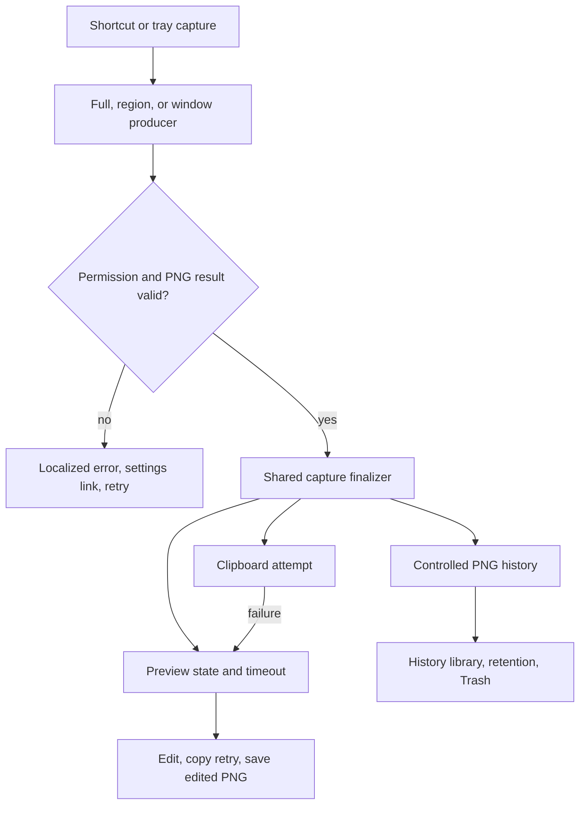

# feat: Ship a reliable macOS screenshot release

## Goal Capsule

Deliver DDU as a macOS-first, local-only screenshot tool that users can trust for the daily path: trigger any capture mode, receive a copied image and a short editable preview, then recover or manage the image in history.

The confirmed scope includes capture, editing, local history, permissions, diagnostics, bilingual and keyboard-accessible UI, release packaging, and test coverage.

The plan does not turn OCR, recording/GIF, workflow automation, cloud sync, or third-party sharing into launch features.

---

## Product Contract

### Summary

DDU is a lightweight, reliable, privacy-first macOS screenshot utility.

It is a menu-bar companion rather than a general media suite.

The primary path is shortcut capture, automatic clipboard copy, a brief editable preview, and paste into any target app.

### Problem Frame

The repository has working capture, smart selection, editor, history, settings, and permission primitives.

Those primitives do not yet form one trustworthy release experience: capture results are not copied automatically, preview timing is undefined, history deletion is permanent, several release-only surfaces have no UI, and the project lacks browser-level automated coverage.

The prior daily-reliability requirements remain useful evidence for the safety work already landed, but their self-use-only packaging boundary is superseded by this confirmed release scope.

### Requirements

**Capture and immediate sharing**

- R1. macOS is the supported release platform. Linux remains explicitly experimental.
- R2. Full-screen, smart region, and window capture are first-class and equally discoverable from the tray and configurable global shortcuts.
- R3. Every successful capture is encoded as PNG, saved locally, copied to the clipboard, and shown in an editable preview.
- R4. Clipboard failure does not discard the capture. The preview and history retain it and expose a retryable copy action.
- R5. The preview auto-hides after five seconds unless the user is interacting with it or editing.

**Editing and privacy**

- R6. The editor supports the existing annotation set, including text, steps, and irreversible pixelation.
- R7. The editor presents pixelation as the sensitive-data protection tool. Soft blur is not presented as secure redaction.
- R8. Saving an edited image creates a new `_edited` PNG in controlled history and does not overwrite the original capture.

**Local history and data handling**

- R9. The home window is a history library for viewing, copying, opening, selecting, combining, and deleting captures.
- R10. New installations retain images locally for 30 days by default with cleanup enabled. Users can choose 7 days, 90 days, or forever.
- R11. User-initiated deletion moves files to the macOS Trash. Automatic retention cleanup has an equally explicit, documented cleanup path.
- R12. No account, cloud sync, telemetry, or app-specific sharing integration is included.

**Guidance and quality**

- R13. First-run guidance explains screen-recording access without blocking app exploration. Accessibility access is an optional smart-capture enhancement.
- R14. A local-only diagnostics view can be inspected or copied by the user and never uploads data.
- R15. The release UI is consistently Chinese and English, supports keyboard navigation, labels controls for assistive technology, and communicates capture, copy, permission, and deletion state.
- R16. The app offers a transparent update notice that links to the download page. It does not self-install updates.
- R17. A direct-download DMG is Developer ID signed, notarized, stapled, and manually verified before release.
- R18. Release quality requires automated coverage of the three capture routes, clipboard behavior, editor persistence, history retention/deletion, and permission recovery, plus a macOS manual acceptance pass for OS-owned interactions.

### Key Decisions

- KTD1. **Keep macOS-first scope.** (session-settled: user-approved — chosen over equal Linux support: reliable behavior on one supported platform is the release priority.) Governs R1, R17.
- KTD2. **Make every capture mode part of the same copy-first pipeline.** (session-settled: user-approved — chosen over a single region-only mode and manual copy: all three modes are valuable, but immediate paste is the core job.) Governs R2, R3, R4, R5.
- KTD3. **Use lossless PNG for capture and history.** (session-settled: user-directed — chosen over WebP-first storage: compatibility and a proven existing pipeline outrank file-size savings.) Governs R3, R8, R10.
- KTD4. **Keep data local and remove unfinished product surfaces from launch UI.** (session-settled: user-approved — chosen over cloud, telemetry, OCR, recording, and workflows in the launch product: privacy and reliability beat breadth.) Governs R12, R14.
- KTD5. **Preserve originals and use recoverable user deletion.** (session-settled: user-approved — chosen over overwrite and permanent deletion: history is a safety net.) Governs R8, R11.
- KTD6. **Ship a notarized direct-download DMG with a non-installing update notice.** (session-settled: user-approved — chosen over development builds, App Store release, or automatic installation: distribution trust without adding an updater subsystem.) Governs R16, R17.

### Key Flows

- F1. Capture and paste
  - **Trigger:** The user selects any capture action from a shortcut or the tray.
  - **Steps:** DDU validates required permission, captures to controlled PNG history, copies to the clipboard, then shows the preview.
  - **Outcome:** The user can paste immediately, or edit/copy again without losing the original.

- F2. Permission recovery
  - **Trigger:** A capture needs unavailable Screen Recording or optional Accessibility permission.
  - **Steps:** DDU states why the permission is needed, opens the relevant System Settings pane on request, refreshes state, and offers retry or restart where macOS needs it.
  - **Outcome:** Permission denial is understandable and recoverable.

- F3. History lifecycle
  - **Trigger:** The user manages a saved capture or the retention policy reaches an old capture.
  - **Steps:** DDU shows only controlled capture files, keeps the original when an edited copy is saved, and sends user-deleted captures to Trash.
  - **Outcome:** Users can recover from a mistaken deletion and understand automatic cleanup.

### Acceptance Examples

- AE1. **Automatic copy:** Given Screen Recording is granted, when the user triggers each capture mode, then a PNG exists in history, the clipboard contains that image, and the preview appears.
- AE2. **Copy recovery:** Given clipboard access fails after a valid capture, when the preview opens, then the capture remains available and retrying copy can succeed without another capture.
- AE3. **Safe edit:** Given a capture is pixelated and saved, when the edited file is reopened, then the covered source pixels are not recoverable and the original capture remains present.
- AE4. **Recoverable deletion:** Given a selected history item, when the user confirms deletion, then it no longer appears in DDU and is present in macOS Trash.
- AE5. **Optional accessibility:** Given only Screen Recording is granted, when the user starts smart capture, then manual region selection still completes and the UI explains the optional enhancement.

### Scope Boundaries

**Deferred for later**

- WebP export, custom export quality controls, and compression of archived screenshots.
- Rich search, tags, favorites, scrolling capture, and history workflow rules.
- OCR UI, local sensitive-content scanning, recording, GIF conversion, and any cloud or third-party share destination.

**Outside this product's identity**

- Accounts, cloud synchronization, telemetry, automatic update installation, and app-specific send integrations.
- A supported Linux or Windows release.

### Product Contract Preservation

Changed from the legacy product contract: its R1-R13 safety, capture, settings, and composition intent remains a verification baseline; its deferred packaging, i18n, and first-run guidance boundary is superseded by R13-R18 above.

---

## Planning Contract

### Key Technical Decisions

- KTD7. **Centralize post-capture handling behind a result object.** All capture producers will hand one validated PNG result to an orchestration seam that persists history, attempts clipboard copy, emits preview state, schedules preview expiry, and triggers retention pruning. This prevents tray, shortcut, and overlay paths from drifting.
- KTD8. **Keep controlled-storage bytes and user-chosen exports distinct.** Editor “Save” writes a new controlled history PNG. “Export copy” remains an explicit dialog-led future surface, so storage guards, history, and original preservation have one meaning.
- KTD9. **Use a macOS-native Trash adapter, not direct file removal, for user deletion.** The adapter is isolated behind history operations. Retention cleanup is separately named and surfaced because it cannot promise Trash recovery at scale.
- KTD10. **Introduce a small typed settings and UI-state boundary.** Shared defaults and parsing live in Rust for enforced behavior, while Vue settings use typed store access and translated labels. Missing or malformed values resolve to safe defaults.
- KTD11. **Treat operating-system interactions as integration boundaries.** Pure selection, retention, settings, localization, and UI-state logic receives automated tests. Clipboard, Screen Recording, Accessibility, Trash, signed DMG, and Gatekeeper behavior receive deterministic adapters plus macOS manual smoke checks.
- KTD12. **Use a constrained version manifest and download URL for update notices.** The check reads only public version metadata from a fixed HTTPS origin. It accepts a validated version and allowlisted download URL, never sends user or capture data, and fails silently except in a user-initiated “check now” action.
- KTD13. **Migrate retention without surprising existing users.** New installations enable the 30-day default. Existing installations preserve their prior cleanup opt-in state and receive a one-time, localized explanation before any changed policy can delete history.

### High-Level Technical Design

### Assumptions

- The release owner will supply an Apple Developer Program membership, Developer ID Application certificate, notarization credentials, release-host URL, and update-manifest hosting before the release unit starts.
- A new frontend test runner is acceptable because the existing project has only Rust unit tests and build checks.
- Automatic retention cleanup can use a clear permanent-delete warning when moving every aged file to Trash is impractical; user-initiated deletion remains recoverable.

### Sequencing

Build the test seam and shared capture state before changing visible behavior.

Then complete history/editor data semantics, followed by user-facing settings, permission, diagnostics, and language work.

Finish with packaging and release verification after the product path is stable.

### System-Wide Impact

Capture output becomes a shared contract across Rust commands, windows, Vue preview/editor state, history, and clipboard.

Storage changes affect user data, retention, custom save paths, and Trash semantics.

Release work adds external Apple credentials but must keep them out of the repository and diagnostics output.

---

## Implementation Units

### U1. Establish test seams and release-safe settings defaults

- **Goal:** Add frontend test infrastructure and isolate pure settings, filename, preview-timing, and retention decisions before behavior changes.
- **Requirements:** R3, R5, R10, R15, R18.
- **Dependencies:** None.
- **Files:** `package.json`, `pnpm-lock.yaml`, `vite.config.ts`, new frontend test setup and test files, `src-tauri/src/cmd/history.rs`, `src-tauri/src/platform/mac/screenshot.rs`, `src-tauri/src/common.rs`.
- **Approach:** Add a Vue-compatible test runner and keep OS calls behind small adapters. Extract pure Rust helpers for capture filenames, retention eligibility, and settings decoding. Enable 30-day cleanup for fresh settings only, while preserving the prior opt-in state for migrated stores.
- **Patterns to follow:** Existing pure Rust tests in `src-tauri/src/smart_capture.rs` and `src-tauri/src/cmd/permissions.rs`; `LazyStore` setting shape in `src/pages/setting/componnets/HistorySettings.vue`.
- **Test scenarios:**
  - A missing retention setting resolves to 30 days and an explicit forever value disables age eligibility.
  - A fresh settings store enables 30-day cleanup, while an existing store without cleanup opt-in is not silently migrated into deletion.
  - A malformed setting never causes a panic or unbounded deletion.
  - Filename generation cannot collide for repeated captures in the same second.
  - Preview timeout pauses while interaction or editing is active and resumes after interaction ends.
- **Verification:** Rust unit tests and the frontend test suite run from the repository scripts; type checking remains clean.

### U2. Create one copy-first capture finalizer

- **Goal:** Route full-screen, smart region, and window captures through a shared result handler that stores PNG, copies it, opens preview, reports failure, and triggers retention pruning.
- **Requirements:** R2, R3, R4, R5, R18; KTD2, KTD3, KTD7.
- **Dependencies:** U1.
- **Files:** `src-tauri/src/global_shortcut.rs`, `src-tauri/src/menu.rs`, `src-tauri/src/cmd/screenshot.rs`, `src-tauri/src/cmd/smart_capture.rs`, `src-tauri/src/platform/mac/screenshot.rs`, `src-tauri/src/cmd/common.rs`, `src-tauri/src/window.rs`, `src/pages/preview/App.vue`, new Rust and Vue test files.
- **Approach:** Replace producer-specific preview handling with a single typed completion event. Attempt original-PNG clipboard copy before preview display. Preserve a structured copy error in preview state and expose a retry without recapturing. Implement a cancellable five-second preview timer that does not fire while the user hovers or edits.
- **Patterns to follow:** `post_capture_flow` in `src-tauri/src/global_shortcut.rs`; smart-capture cleanup in `src-tauri/src/cmd/smart_capture.rs`; path-guarded clipboard commands in `src-tauri/src/cmd/common.rs`.
- **Test scenarios:**
  - Each capture-action mapping reaches the same finalizer with the expected mode and PNG path.
  - A successful finalizer emits preview data and invokes clipboard copy once.
  - A clipboard error leaves the persisted capture and exposes a retryable failure state.
  - Timeout never closes an active editor and closes an untouched preview once.
  - Permission denial never writes a partial history item or leaves the capture overlay visible.
- **Verification:** Unit coverage proves the routing and failure state; a macOS smoke check exercises all three tray and shortcut entries.

### U3. Make editor save and privacy language match the storage contract

- **Goal:** Preserve originals, create controlled edited PNG history copies, and make secure-redaction guidance unambiguous.
- **Requirements:** R6, R7, R8, R18; KTD3, KTD5, KTD8.
- **Dependencies:** U1, U2.
- **Files:** `src/pages/preview/editor/useEditor.ts`, `src/pages/preview/editor/EditorToolbar.vue`, `src/pages/preview/editor/ImageEditor.vue`, `src-tauri/src/cmd/export.rs`, `src-tauri/src/cmd/common.rs`, `src-tauri/src/cmd/history.rs`, new frontend and Rust test files.
- **Approach:** Keep existing irreversible pixelation behavior. Rename and describe tools consistently in both languages. Add a controlled-save command that assigns an `_edited` PNG name, validates the base image context, limits decoded image size before persistence, returns the new history item, and leaves dialog-based export outside the default save action.
- **Patterns to follow:** `applyPrivacyEffect` and `exportImage` in `src/pages/preview/editor/useEditor.ts`; path guards in `src-tauri/src/common.rs`.
- **Test scenarios:**
  - Pixelation export contains altered source pixels while annotations remain in the output.
  - Saving an edit creates a distinct controlled PNG and keeps the original history item.
  - Copying an edited result replaces clipboard contents without creating a temporary image file.
  - Soft blur has a visible non-security warning in Chinese and English.
  - A malformed image payload or controlled-path failure returns an actionable error and preserves the editor session.
  - An oversized or non-image save payload is rejected before it can exhaust memory or create a history file.
- **Verification:** Automated output and storage tests pass; manual visual inspection confirms pixelation and text rendering at native resolution.

### U4. Deliver safe history lifecycle and a focused history library

- **Goal:** Make history the main-window responsibility, use macOS Trash for user deletion, and apply the confirmed retention policy safely.
- **Requirements:** R9, R10, R11, R18; KTD5, KTD9, KTD10.
- **Dependencies:** U1, U2, U3.
- **Files:** `src-tauri/src/cmd/history.rs`, new macOS Trash support under `src-tauri/src/platform/mac/`, `src-tauri/src/platform/mod.rs`, `src/pages/main/App.vue`, `src/pages/main/components/SnapVault.vue`, `src/pages/main/components/SnapVaultItem.vue`, `src/pages/setting/componnets/HistorySettings.vue`, new Rust and Vue test files.
- **Approach:** Separate user deletion from retention cleanup. Move controlled user-selected files to Trash and return per-item results. Keep retention limited to app-owned PNG names and present its permanent-cleanup behavior plainly. Apply the new default only to fresh installs; existing users see a one-time policy explanation before enabling cleanup. Add quick copy/open actions, selection feedback, empty states, and a refresh contract to the history library.
- **Patterns to follow:** Existing controlled-directory checks and `HistoryItem` metadata in `src-tauri/src/cmd/history.rs`; combined-image behavior in `src/pages/main/components/SnapVault.vue`.
- **Test scenarios:**
  - Default 30-day cleanup selects only old app-owned PNG files and ignores user files in a custom directory.
  - 7-day, 90-day, and forever settings produce the correct eligibility boundaries.
  - A migrated settings store never starts cleanup until its retained policy state or the user's follow-up choice permits it.
  - User deletion requests Trash movement only for controlled existing files and reports failures without claiming success.
  - Deleting a history item refreshes the library and leaves no stale selection.
  - Copy, open, combine, and empty-history controls remain keyboard reachable.
- **Verification:** Rust policy tests pass; manual macOS check confirms a user-deleted screenshot is recoverable from Trash.

### U5. Align settings, permission onboarding, diagnostics, and language

- **Goal:** Present only launch-relevant settings and permissions, provide local diagnostics, and make primary UI paths bilingual and accessible.
- **Requirements:** R13, R14, R15, R16, R18; KTD4, KTD10, KTD12.
- **Dependencies:** U1, U2, U4.
- **Files:** `src/pages/startup/App.vue`, `src/pages/setting/App.vue`, `src/pages/setting/componnets/CaptureSettings.vue`, `src/pages/setting/componnets/ShortcutSettings.vue`, `src/pages/setting/componnets/HistorySettings.vue`, new settings/diagnostics Vue components, `src-tauri/src/cmd/permissions.rs`, `src-tauri/src/cmd/diagnostics.rs`, `src-tauri/src/lib.rs`, `src-tauri/src/menu.rs`, new locale modules and test files.
- **Approach:** Show Screen Recording as needed when capture is attempted, position Accessibility as optional for smarter snapping, and remove microphone/recording language from launch guidance. Make autostart reflect the user's actual setting instead of forcing it during setup. Connect each retained capture setting to runtime behavior or remove it from the launch UI. Add an explicit local diagnostics screen with copy-to-clipboard. Replace mixed literals with a lightweight locale catalog and add accessible names, focus order, keyboard actions, and status announcements. Keep a transparent version-manifest update check separate from analytics.
- **Patterns to follow:** Polling and restart behavior in `src/pages/startup/App.vue`; permission DTOs in `src-tauri/src/cmd/permissions.rs`; diagnostics bundle in `src-tauri/src/cmd/diagnostics.rs`.
- **Test scenarios:**
  - A new user can defer Screen Recording guidance, later grant it, restart when required, and retry capture.
  - Smart capture remains usable without Accessibility and states the reduced behavior.
  - Autostart remains disabled after restart when the user turns it off, and no unused launch arguments are registered.
  - Diagnostics content contains app, OS, capability, and permission state but no image paths or user capture data.
  - Every launch-setting control has Chinese and English labels, keyboard focus, and an accessible name.
  - A failed or malformed version manifest leaves normal capture unaffected; only a newer compatible version with an allowlisted HTTPS download URL shows a notice.
- **Verification:** Frontend state tests pass; macOS manual pass confirms TCC recovery and diagnostic copy behavior.

### U6. Remove non-launch feature exposure and align menus with product scope

- **Goal:** Keep unfinished capabilities in code only where harmless, while exposing a coherent screenshot-only product through tray, home, preview, settings, diagnostics, and documentation.
- **Requirements:** R1, R2, R9, R12, R15; KTD1, KTD4.
- **Dependencies:** U2, U4, U5.
- **Files:** `src-tauri/src/menu.rs`, `src-tauri/src/cmd/diagnostics.rs`, `src/pages/main/App.vue`, `src/pages/setting/App.vue`, `README.md`, `README_cn.md`, `docs/README.md`, new UI test files.
- **Approach:** Make capture, history, settings, diagnostics, update check, and quit the only launch-facing menus and labels. Remove or relabel OCR, recording, microphone, workflows, cloud, and third-party-send promises. Mark Linux experimental in release-facing documentation without removing portability code.
- **Patterns to follow:** Tray menu routing in `src-tauri/src/menu.rs`; capability records in `src-tauri/src/cmd/diagnostics.rs`.
- **Test scenarios:**
  - Launch-facing menus expose the three capture modes and history/settings actions without recording or workflow entries.
  - Documentation describes local PNG capture, copy, edit, and history without promising excluded integrations.
  - Diagnostics can report an unavailable experimental capability without making it a primary UI action.
- **Verification:** UI tests and a manual menu audit match the product contract in both languages.

### U7. Add signed, notarized DMG packaging and transparent release updates

- **Goal:** Produce a direct-download macOS release that Gatekeeper can verify and users can update without an auto-installer.
- **Requirements:** R16, R17, R18; KTD1, KTD6, KTD12.
- **Dependencies:** U5, U6.
- **Files:** `src-tauri/tauri.conf.json`, `src-tauri/Info.plist`, release scripts or CI configuration, release documentation, download-page/version-manifest configuration, `README.md`, `README_cn.md`.
- **Approach:** Configure Developer ID signing through environment-backed credentials only. Build DMG artifacts, submit them through the current notarization workflow, staple the returned ticket, and validate signature, stapling, and fresh-machine install behavior. Publish a minimal version manifest and release page used by the update notice; never embed credentials in source or diagnostics.
- **Patterns to follow:** Existing DMG script in `package.json`; Tauri v2 distribution guidance.
- **Test scenarios:**
  - A release build fails early when required signing inputs are absent rather than producing an ambiguous distributable.
  - A signed DMG passes signature, notarization, and stapling validation.
  - A fresh macOS install can grant permissions, capture, paste, edit, view history, and open the update-download link.
  - The update check consumes only public version metadata and tolerates an unreachable endpoint.
- **Verification:** Release-owner macOS checklist passes before publishing; generated artifacts and notarization logs are retained outside version control.

### U8. Run release verification and document operational recovery

- **Goal:** Turn the product contract into repeatable automated and manual release gates.
- **Requirements:** R4, R7, R11, R13, R14, R15, R17, R18.
- **Dependencies:** U1, U2, U3, U4, U5, U6, U7.
- **Files:** test files introduced by U1-U7, `README.md`, `README_cn.md`, release checklist documentation, diagnostics support documentation.
- **Approach:** Assemble a single release checklist around the three capture routes, permission denial/recovery, clipboard retry, editor persistence, history Trash recovery, localization/accessibility, privacy boundary, update notice, and notarized-install smoke check. Document how users gather and copy local diagnostics without sending data.
- **Patterns to follow:** Existing Rust test layout and permission test cases; release constraints in `src-tauri/tauri.conf.json`.
- **Test scenarios:**
  - Full-screen, region, and window captures satisfy the automatic-copy acceptance case.
  - Screen Recording denial and grant/restart recovery are covered without a crash or stranded overlay.
  - Pixelation, edited-copy preservation, retention policy, and Trash deletion each meet their acceptance examples.
  - Keyboard-only traversal and both language catalogs cover tray-reachable and window-reachable user actions.
  - The direct-download artifact passes Gatekeeper checks on a clean macOS account.
- **Verification:** All automated gates pass, the manual macOS checklist is recorded for the release candidate, and no excluded feature appears in launch-facing UI or documentation.

---

## Verification Contract

| Gate | Applies to | Done signal |
| --- | --- | --- |
| `pnpm build:web` | U1-U8 | Type checking and production frontend build pass. |
| Frontend test script introduced by U1 | U1-U8 | Preview, editor, history, settings, locale, and accessibility state scenarios pass. |
| `cargo test --manifest-path src-tauri/Cargo.toml` | U1-U8 | Pure Rust capture, history, permissions, path, and storage policy tests pass. |
| macOS permission and clipboard smoke | U2, U5, U8 | All capture modes, clipboard retry, and TCC recovery work on a clean user profile. |
| macOS release-artifact smoke | U7, U8 | Signed, notarized, stapled DMG installs and runs through Gatekeeper. |

---

## Risks & Dependencies

- macOS TCC state, clipboard access, Accessibility APIs, and Gatekeeper cannot be fully simulated in unit tests. The release checklist is a required complement, not a fallback for missing test coverage.
- Moving to Trash requires careful error reporting and a documented distinction from automatic retention cleanup.
- Version checking introduces a network dependency. The manifest must be public, minimal, failure-tolerant, and free of user data.
- Developer ID and notarization credentials are external prerequisites. No release step should silently downgrade to ad-hoc signing.
- Existing custom save paths must continue to work through Rust path guards and backend image reads.

---

## Sources & Research

- `docs/brainstorms/2026-06-29-harden-macos-daily-reliable-requirements.md` and `docs/plans/2026-06-29-001-feat-harden-macos-daily-reliable-plan.md` document the earlier safety contract and code patterns now present in the repository.
- `docs/brainstorms/2026-07-09-smart-capture-requirements.md` and `src-tauri/src/cmd/smart_capture.rs` establish the frozen-snapshot smart capture lifecycle.
- `src-tauri/src/global_shortcut.rs`, `src-tauri/src/menu.rs`, and `src/pages/preview/App.vue` show the current fragmented post-capture paths that U2 unifies.
- `src-tauri/src/cmd/history.rs` and `src/pages/setting/componnets/HistorySettings.vue` show current permanent deletion and opt-in retention behavior that U4 replaces.
- [Tauri v2 distribution guidance](https://v2.tauri.app/distribute/) states that direct macOS DMG distribution requires signing and notarization.
- [Apple notarization guidance](https://developer.apple.com/documentation/security/notarizing-macos-software-before-distribution) requires Developer ID signing and uses the current `notarytool` workflow for direct distribution.

---

## Definition of Done

- The three macOS capture modes use the shared PNG, copy-first completion pipeline and leave no failed or canceled overlay behind.
- Users can paste a capture immediately, retry a failed clipboard copy, edit safely, preserve the original, and manage history with recoverable deletion.
- The launch UI contains only the confirmed screenshot product, works in Chinese and English, and supports keyboard and assistive technology use.
- Permission guidance, local diagnostics, and update notices are understandable without telemetry or cloud accounts.
- Automated Rust and frontend tests pass, and the recorded macOS manual acceptance pass covers OS-owned behavior.
- The release DMG is signed, notarized, stapled, and verified before distribution.
- No abandoned experimental code, debug-only credential handling, or excluded product claims remain in the release diff.
